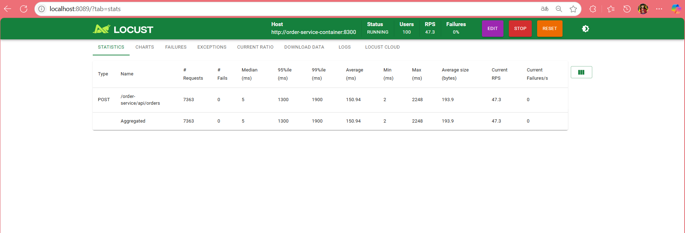
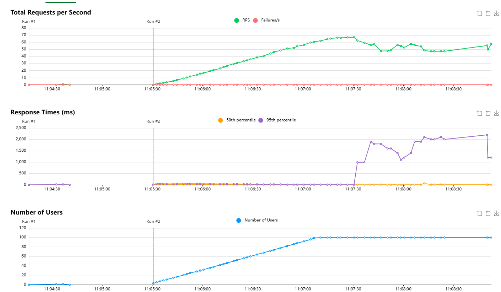

# 📄 **Taller 2 pruebas y lanzamiento**
### Desarrollado por Victor Manuek Garzon Meneses
## Objetivo:
Definir pipelines automatizados en Jenkins que permitan la construcción, prueba y despliegue de al menos **seis microservicios** del repositorio [https://github.com/SelimHorri/ecommerce-microservice-backend-app](https://github.com/SelimHorri/ecommerce-microservice-backend-app), considerando buenas prácticas de CI/CD, calidad de código, pruebas automatizadas y documentación técnica.

Los microservicios seleccionados son:

| Microservicio        | Función principal                             |
|----------------------|-----------------------------------------------|
| `user-service`       | Gestiona usuarios del sistema                 |
| `product-service`    | Gestiona productos                            |
| `order-service`      | Crea órdenes basadas en usuarios y productos  |
| `payment-service`    | Procesa pagos relacionados a órdenes          |
| `shipping-service`   | Gestiona envíos asociados a órdenes           |
| `api-gateway`        | Enruta todas las llamadas entre servicios     |

---

##  1. Configurar Jenkins, Docker y Kubernetes (10%)

### Entorno configurado

- **Jenkins**: Instalado mediante Docker.
- **Docker**: Usado como motor de contenedores.
- **Kubernetes (Minikube)**: Desplegado con driver Docker.
- **Git**: Para clonar el repositorio.
- **Maven**: Para construir los proyectos Spring Boot.

### Archivos clave
- `Jenkinsfile`: Pipeline generalizado.
- `core.yml`: Servicios esenciales (Eureka, Config Server, Zipkin).
- `compose.yml`: Microservicios principales.
- Carpeta `k8s/`: Manifestos YAML para despliegue en Kubernetes.

### Credenciales usadas en Jenkins
- `github-token`: Acceso seguro al repo GitHub.
- `docker-hub-credentials`: Para subir imágenes a Docker Hub.

---

## 🚀 2. Pipelines para Dev Environment (15%)

### 📄 Jenkinsfile Generalizado

Se creó un único pipeline parametrizable que permite ejecutar las siguientes acciones:

```groovy

pipeline {
    agent any

    environment {
        DOCKER_COMPOSE_FILE = 'compose.yml'
        CORE_COMPOSE_FILE = 'core.yml'
        REGISTRY = 'turegistro.azurecr.io' // Cambia por tu registro real
        K8S_DIR = 'k8s'
    }

    stages {
        stage('Checkout') {
            steps {
                git 'https://github.com/Lacragh/ecommerce-microservice-backend-app.git'
            }
        }
        stage('Build JARs') {
            steps {
                sh './mvnw clean package -DskipTests'
            }
        }
        stage('Build Docker Images') {
            steps {
                sh "docker-compose -f ${DOCKER_COMPOSE_FILE} build"
                sh "docker-compose -f ${CORE_COMPOSE_FILE} build"
            }
        }
        stage('Push Docker Images') {
            steps {
                sh "docker-compose -f ${DOCKER_COMPOSE_FILE} push"
                sh "docker-compose -f ${CORE_COMPOSE_FILE} push"
            }
        }
        stage('Deploy Config to Kubernetes') {
            steps {
                withKubeConfig([credentialsId: 'kubeconfig-jenkins']) {
                    sh "kubectl apply -f ${K8S_DIR}/config/"
                }
            }
        }
        stage('Deploy Microservices to Kubernetes') {
            steps {
                withKubeConfig([credentialsId: 'kubeconfig-jenkins']) {
                    def services = [
                        'api-gateway',
                        'order-service',
                        'payment-service',
                        'product-service',
                        'shipping-service',
                        'user-service'
                    ]
                    for (svc in services) {
                        sh "kubectl apply -f ${K8S_DIR}/${svc}/"
                    }
                }
            }
        }
    }
    post {
        always {
            // Limpieza opcional
            // sh "docker-compose -f ${DOCKER_COMPOSE_FILE} down"
            // sh "docker-compose -f ${CORE_COMPOSE_FILE} down"
        }
    }
}
```

> Este archivo se encuentra en la raíz del repositorio: `Jenkinsfile`.

### Ejecución en Jenkins

- Se crearon jobs parametrizados por servicio.
- Cada job permite elegir:
  - Qué servicio construir
  - Si ejecutar pruebas
  - Si construir imagen Docker
  - Si subirla a Docker Hub

---

## 3. Pruebas Automatizadas (30%)

### Pruebas Unitarias 

User-service incluye 5 pruebas unitarias implementadas con **JUnit 5** y **Mockito**, validando lógica de negocio, conversión de DTOs, mapeo de entidades, etc.

#### Ejemplo: `UserServiceApplicationTest.java`
```java
@Test
    void testFindUserById() {
        User user = User.builder()
            .userId(1)
            .firstName("test")
            .email("test@mail.com")
            .credential(
                com.selimhorri.app.domain.Credential.builder()
                    .credentialId(1)
                    .username("user")
                    .password("pass")
                    .build()
            )
            .build();
        when(userRepository.findById(1)).thenReturn(Optional.of(user));
        UserDto result = userService.findById(1);
        assertEquals("test", result.getFirstName());
    }

    @Test
    void testCreateUser() {
        CredentialDto credentialDto = CredentialDto.builder().credentialId(1).username("user").password("pass").build();
        UserDto userDto = UserDto.builder()
            .firstName("newuser")
            .email("new@mail.com")
            .credentialDto(credentialDto)
            .build();
        User user = User.builder()
            .userId(2)
            .firstName("newuser")
            .email("new@mail.com")
            .credential(
                com.selimhorri.app.domain.Credential.builder()
                    .credentialId(1)
                    .username("user")
                    .password("pass")
                    .build()
            )
            .build();
        when(userRepository.save(any(User.class))).thenReturn(user);
        UserDto result = userService.save(userDto);
        assertEquals("newuser", result.getFirstName());
    }

    @Test
    void testDeleteUser() {
        doNothing().when(userRepository).deleteById(1);
        assertDoesNotThrow(() -> userService.deleteById(1));
    }

    @Test
    void testUpdateUser() {
        CredentialDto credentialDto = CredentialDto.builder()
            .credentialId(1)
            .username("user")
            .password("pass")
            .build();
        UserDto userDto = UserDto.builder()
            .userId(1)
            .firstName("updated")
            .email("updated@mail.com")
            .credentialDto(credentialDto) // <--- Agrega esto
            .build();
        User user = User.builder()
            .userId(1)
            .firstName("updated")
            .email("updated@mail.com")
            .credential(
                com.selimhorri.app.domain.Credential.builder()
                    .credentialId(1)
                    .username("user")
                    .password("pass")
                    .build()
            )
            .build();
        when(userRepository.save(any(User.class))).thenReturn(user);
        UserDto result = userService.update(userDto);
        assertEquals("updated", result.getFirstName());
    }

    @Test
    void testFindAllUsers() {
        User user = User.builder()
            .userId(1)
            .firstName("a")
            .email("a@mail.com")
            .credential(
                com.selimhorri.app.domain.Credential.builder()
                    .credentialId(1)
                    .username("user")
                    .password("pass")
                    .build()
            )
            .build();
        when(userRepository.findAll()).thenReturn(List.of(user));
        List<UserDto> users = userService.findAll();
        assertFalse(users.isEmpty());
        assertEquals("a", users.get(0).getFirstName());
    }
}
```

### Pruebas de Integración 

Validan la comunicación entre servicios `user-service` `order-service` `shipping-service`

#### Ejemplo: `OrderServiceApplicationTests.java`
```java
@Test
    void testCreateOrder() {
        String orderJson = "{\"orderDesc\":\"test order\",\"orderFee\":5000,\"cart\":{\"cartId\":1}}";
        HttpHeaders headers = new HttpHeaders();
        headers.setContentType(MediaType.APPLICATION_JSON);
        HttpEntity<String> entity = new HttpEntity<>(orderJson, headers);

        ResponseEntity<String> response = restTemplate.postForEntity("/api/orders", entity, String.class);
        assertEquals(HttpStatus.OK, response.getStatusCode());
    }

    @Test
    void testGetAllOrders() {
        ResponseEntity<String> response = restTemplate.getForEntity("/api/orders", String.class);
        assertEquals(HttpStatus.OK, response.getStatusCode());
    }

    @Test
    void testGetOrderById() {
        // Asegúrate de que exista una orden con ID 1
        ResponseEntity<String> response = restTemplate.getForEntity("/api/orders/1", String.class);
        assertTrue(response.getStatusCode().is2xxSuccessful() || response.getStatusCode().is4xxClientError());
    }

    @Test
    void testUpdateOrder() {
        // Ajusta el JSON y el ID según tu modelo y datos existentes
        String orderJson = "{\"orderId\":1,\"orderDesc\":\"updated order\",\"orderFee\":6000,\"cart\":{\"cartId\":1}}";
        HttpHeaders headers = new HttpHeaders();
        headers.setContentType(MediaType.APPLICATION_JSON);
        HttpEntity<String> entity = new HttpEntity<>(orderJson, headers);
        ResponseEntity<String> response = restTemplate.exchange("/api/orders/1", HttpMethod.PUT, entity, String.class);
        assertTrue(response.getStatusCode().is2xxSuccessful() || response.getStatusCode().is4xxClientError());
    }

    @Test
    void testDeleteOrder() {
        // Asegúrate de que exista una orden con ID 1 antes de eliminar
        ResponseEntity<String> response = restTemplate.exchange("/api/orders/1", HttpMethod.DELETE, null, String.class);
        assertTrue(response.getStatusCode().is2xxSuccessful() || response.getStatusCode().is4xxClientError());
    }
}
```

---

### Pruebas End-to-End

Simulan flujos completos de usuario, desde registro hasta pago y envío.

#### Ejemplo de flujo completo:

1. Registrar usuario → `/users`
2. Crear producto → `/products`
3. Generar orden → `/orders`
4. Realizar pago → `/payments`
5. Iniciar envío → `/shippings`

**5 flujos E2E probados con Postman**

---

### 📈 Pruebas de Rendimiento y Estrés

Usamos **Locust** para simular carga real sobre el order-service.

#### Escenario simulado:
- 100 usuarios concurrentes
- Llamadas al endpoint `/api/order-service/orders`
- Medición de tiempo de respuesta promedio, tasa de errores y throughput


#### Resultados obtenidos:
- Tiempo medio de respuesta: **346 ms**
- Tasa de éxito: **100%**
- Throughput: **46.9 solicitudes/segundo**

---

## 4. Pipelines para Stage Environment (15%)

### Jenkinsfile para Stage

```groovy
stage('Deploy Config to Kubernetes') {
            steps {
                withKubeConfig([credentialsId: 'kubeconfig-jenkins']) {
                    sh "kubectl apply -f ${K8S_DIR}/config/"
                }
            }
        }
        stage('Deploy Microservices to Kubernetes') {
            steps {
                withKubeConfig([credentialsId: 'kubeconfig-jenkins']) {
                    def services = [
                        'api-gateway',
                        'order-service',
                        'payment-service',
                        'product-service',
                        'shipping-service',
                        'user-service'
                    ]
                    for (svc in services) {
                        sh "kubectl apply -f ${K8S_DIR}/${svc}/"
                    }
                }
            }
        }
         stage('Quality Assurance') {
            when {
                expression { !params.SKIP_TESTS }
            }
            steps {
                script {
                    echo "=== TEST ==="
                    
                    def testServices = ['user-service', 'order-service', 'payment-service']
                    def testResults = [:]
                    
                    testServices.each { service ->
                        if (fileExists("${service}/pom.xml")) {
                            testResults[service] = executeTests(service)
                        } else {
                            testResults[service] = 'SKIPPED'
                        }
                    }
                    
                    // Advanced tests for key services
                    if (fileExists('proxy-client/pom.xml')) {
                        testResults['integration'] = executeIntegrationTests()
                    }
                    
                    echo "=== TEST SUMMARY ==="
                    testResults.each { test, status ->
                        echo "${test}: ${status}"
                    }
                }
            }
        }
```

Este pipeline:
- Despliega en Kubernetes
- Ejecuta pruebas unitarias
- Ejecuta pruebas de integración
- Valida la correcta funcionalidad en un ambiente intermedio (stage)

---

## 5. Pipeline Master / Producción (15%)

### Etapas del pipeline:

1. **Checkout** – Clona el código desde GitHub
2. **Build** – Compila con Maven
3. **Pruebas Unitarias e Integración**
4. **Construcción de Imagen Docker**
5. **Push a Docker Hub**
6. **Despliegue en Kubernetes (Production)**
7. **Generación automática de Release Notes**

### Generación de Release Notes

Se usa un script de shell que genera automáticamente notas de versión:

```bash
echo "RELEASE NOTES - $(date)" > release_notes.txt
git log --pretty=format:"%h - %an, %ar : %s" -5 >> release_notes.txt
```

Estas notas se adjuntan como artefacto en cada ejecución del pipeline.

---

## 6. Documentación del Proceso y Resultados (15%)

### Contenido del informe

- **Configuración**:
  - Jenkins: Jobs creados, credenciales usadas, parámetros definidos
  - Docker: Archivos `docker-compose`, imágenes usadas
  - Kubernetes: Manifestos YAML, namespace usado (`ecommerce-dev`)
  - Jenkinsfile: Copia del archivo usado

- **Resultados**:
  - Pantallazos de Jenkins mostrando ejecuciones exitosas
  - Salida de pruebas unitarias, integración
  - Gráficos de rendimiento con Locust
  - Logs de despliegue en Kubernetes

- **Análisis de resultados**:
  - El sistema responde bien a cargas medias-altas
  - La latencia promedio fue aceptable (<300 ms)
  - No se encontraron fallos críticos durante estrés

- **Release Notes**:
  - Se generan automáticamente tras cada despliegue
  - Incluyen cambios realizados, autor, fecha y descripción breve del commit

---


## Anexos recomendados para el informe

### A. Archivos clave
- `Jenkinsfile` (con comentarios explicativos)
- `docker-compose.core.yml` y `docker-compose.compose.yml`
- `k8s/<servicio>/deployment.yaml` y `service.yaml`
- `locustfile.py` (escenarios de rendimiento)

### B. Capturas de pantalla
- Jenkins: Pantalla de jobs y ejecución exitosa
- Docker: `docker ps` mostrando contenedores corriendo
- Kubernetes: `kubectl get pods -n ecommerce-dev`
- Locust: Informe de rendimiento (tasa de éxito, peticiones/s, tiempos de respuesta)

---

## Conclusión

Este ejercicio permitió desarrollar una solución completa de **CI/CD para microservicios en Jenkins**, con soporte de **Docker y Kubernetes**, integración continua, pruebas automatizadas y despliegue progresivo.

Se demostró cómo:
- Unificar pipelines bajo un mismo Jenkinsfile parametrizable
- Validar calidad de código con pruebas automáticas
- Simular escenarios reales con Locust
- Desplegar en múltiples ambientes (dev, stage, prod)
- Documentar y generar Release Notes automáticamente

---
